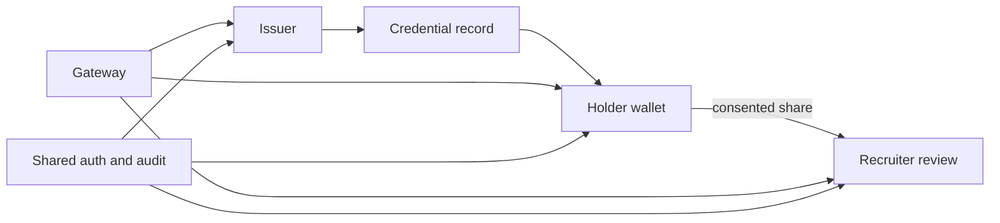

# Credity / CredVerse

**Status:** multi-application prototype · security hardening in progress

Credity is the portfolio repository for the **CredVerse** credential workflow: institutions issue credentials, holders manage and share them, and recruiters verify evidence. The monorepo explores those roles across separate web and mobile surfaces rather than claiming a production identity network.

## Product surfaces

| Surface | Responsibility |
| --- | --- |
| `CredVerseIssuer 3` | Issuer workflows, credential records, and optional chain anchoring |
| `BlockWalletDigi` | Holder wallet and sharing workflows |
| `CredVerseRecruiter` | Recruiter verification and review workflows |
| `credverse-gateway` | Public entry point and service routing |
| `apps/mobile` | Cross-role mobile prototype |
| `packages/shared-auth` | Shared authentication, audit, password, JWT, and webhook code |



## Contribution and verified capabilities

This repository assembles and hardens the role-separated CredVerse product flow. Its source includes password/JWT handling, idempotency and audit-chain utilities, persistent service stores, mobile token-vault code, webhook contracts, and focused tests. These are implementation artifacts, not proof of production deployment or standards certification.

## Local checks

Node applications keep independent lockfiles. Install only the surface you want to inspect, then use the root commands to run the available checks:

```bash
npm install
npm test
npm run lint
npm run check
```

The foundation gate requires configured local services and should be treated separately from unit checks:

```bash
npm run gate:foundation:local
```

## Security boundary

- Keep all `.env` files local and use only documented example values.
- Credential verification remains a reviewer-facing decision aid; a UI result is not independent proof of identity.
- Blockchain and deployment paths require explicit operator configuration and review.
- The separate `credity12` hardening line has not been mechanically merged because its history diverged and a trial reconciliation produced conflicts.

## Limitations

This is a broad prototype monorepo with multiple dependency graphs. Production identity controls, privacy/compliance review, key custody, live-service reliability, and external security certification are not established.

## License

The existing repository license and proprietary notice remain authoritative. No broader reuse permission is implied by public visibility.
